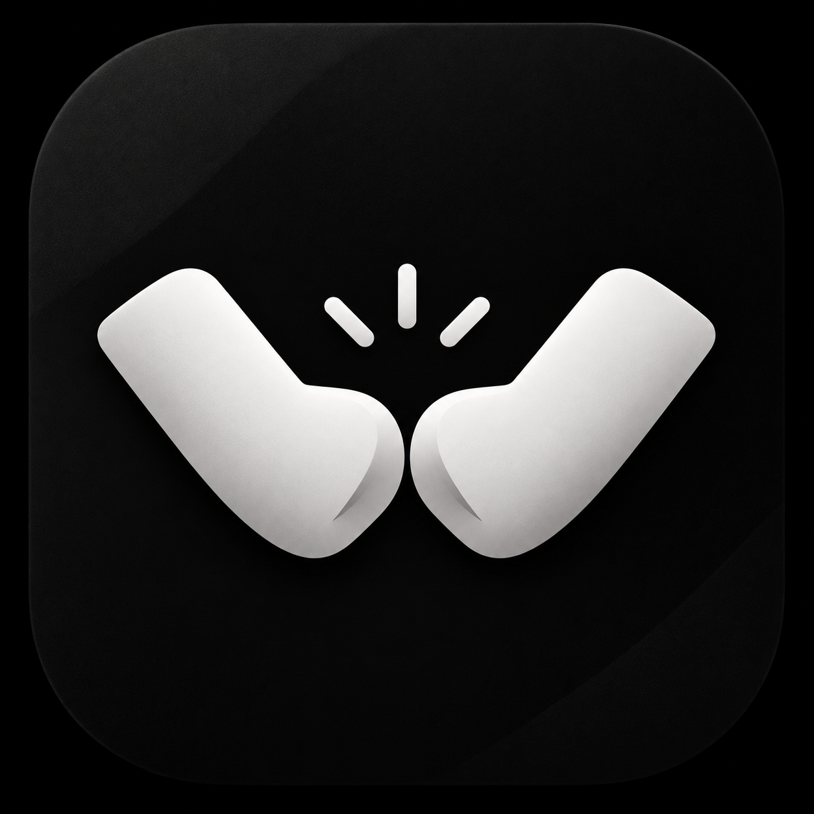
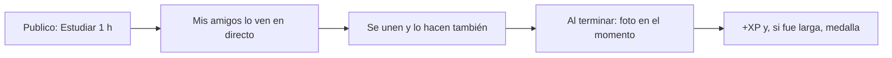
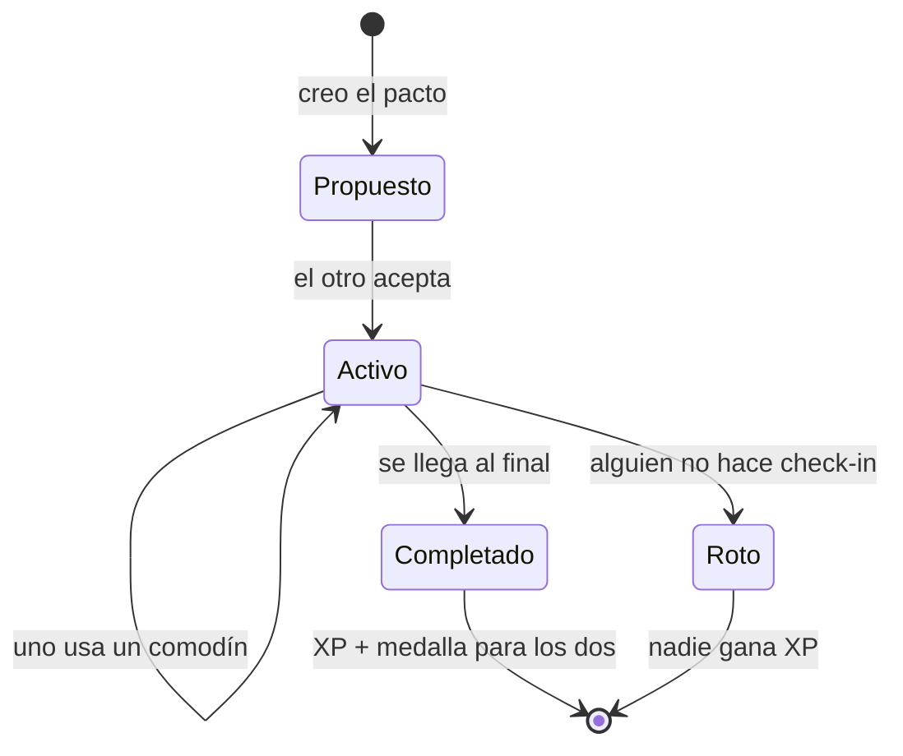
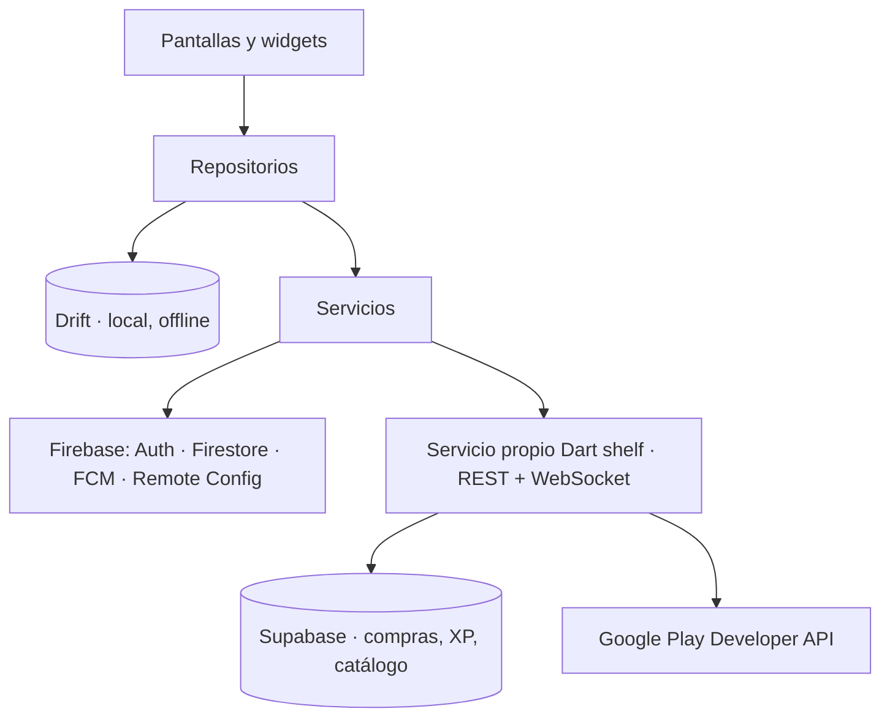

<p align="center">
  
</p>

<h1 align="center">Codo</h1>
<p align="center"><b>Cumple tus objetivos acompañado.</b><br/>
Hazlo ahora con quien está haciendo lo mismo, o comprométete con un amigo en un pacto.</p>

<p align="center">
Flutter · Firebase · Drift · Dart shelf · Supabase · Google Play
</p>

---

## 🎯 El problema
Las apps de organización se abandonan: apuntar tareas es fácil, pero cumplirlas solo cuesta. En compañía cuesta menos. Por eso estudiamos en biblioteca y quedamos para ir al gimnasio.

**Codo convierte tus objetivos en algo compartido.**

## ✨ Cómo funciona

### ⏱️ Ahora — haz tareas acompañado en directo
Publicas lo que vas a hacer y tus amigos se unen haciendo lo mismo. Ves en tiempo real quién está y cuánto le queda.



### 🤝 Pacto — un reto con alguien que no te deja tirar la toalla
Eliges un objetivo y una duración, y lo haces con un amigo o con alguien del tablón de pactos abiertos. Cada día los dos hacéis check-in con una prueba de avance, y el compañero la valida. **Si uno falla, pierden los dos.**



### 📱 Secciones
| Hoy | Ahora | Pactos | Amigos | Perfil |
|:---:|:---:|:---:|:---:|:---:|
| Tus objetivos del día, check-ins pendientes y quién está activo | Sesiones en directo de tus amigos | Tus pactos, invitaciones, tablón y plantillas | Ranking entre amigos y solicitudes | Nivel, medallas, ajustes y Codo Plus |
| _captura pendiente_ | _captura pendiente_ | _captura pendiente_ | _captura pendiente_ | _captura pendiente_ |

### 🏅 Progreso
- **XP → niveles** con nombre propio.
- **Medallas** por objetivos cumplidos: pactos completados, sesiones largas…
- El ranking es **entre amigos** y los puntos **no se compran**. Así hacer trampa no tiene premio.

### 💎 Codo Plus y comodines
| Producto | Tipo | Qué da |
|---|---|---|
| Comodín | Consumible | Saltarte un día de check-in sin romper el pacto |
| Codo Plus | Pago único | Sin anuncios, pactos ilimitados y estadísticas |

---

## 🏗️ Arquitectura



### Estructura de carpetas y por qué está dividida así
```
lib/
├── app/           # MaterialApp, rutas con nombre, tema
├── l10n/          # Textos ES/EN
├── models/        # Clases de dominio y sus conversores
├── services/      # Hablan con fuentes externas (Firebase, API, Billing…)
├── repositories/  # Única puerta de datos para la UI
├── screens/       # Una carpeta por sección
├── widgets/       # Piezas reutilizables
└── utils/
```
Cada capa tiene una única responsabilidad. **Las pantallas no saben de dónde vienen los datos**: se los pide al repositorio, que decide si los lee de la base de datos local o de la nube. Así puedo cambiar Firestore por otra fuente, o probar la lógica con una base de datos en memoria, sin tocar la interfaz. Los **modelos** están separados para que la app trabaje con objetos tipados y no con mapas sueltos.

---

## 🚀 Guía de arranque (en un equipo limpio)

### Requisitos
- Flutter SDK estable (Dart ^3.13). Compruébalo con `flutter doctor`.
- Android Studio con un emulador Android (API 34 o superior) o un móvil con depuración USB.
- Google Chrome (para la versión web).

### Pasos
```bash
git clone https://github.com/Aitoorchs7/codo.git
cd codo
flutter pub get
```
**Configuración de Firebase:** _pendiente (fase 1)_. Aquí se explicará qué ficheros hacen falta, cómo conseguirlos y por qué no están en el repositorio.

```bash
flutter run              # emulador o móvil Android
flutter run -d chrome    # navegador
flutter test             # pruebas
```

### Ficheros que NO están en el repositorio (y por qué)
| Fichero | Para qué sirve | Por qué no se sube |
|---|---|---|
| `android/app/google-services.json` | Conectar Android con Firebase | Identifica el proyecto de Firebase; se mantiene fuera por seguridad |
| `android/key.properties`, `*.jks` | Firmar el .aab de release | Quien tenga la clave podría publicar versiones en mi nombre |
| `.env` | URLs y claves del servicio propio | Son credenciales |

---

## 🧪 Pruebas
| Qué se probó | Esperado | Resultado Android | Resultado web |
|---|---|---|---|
| _pendiente_ | | | |

## 🤖 Trabajo con IA
Este proyecto se desarrolla con asistentes de IA, de forma documentada:
- [`CLAUDE.md`](CLAUDE.md): arquitectura, normas y lo que el agente no debe tocar.
- [`.claude/`](.claude): agentes, skills y comandos propios.
- [`IA.md`](IA.md): bitácora de qué pedí, qué me dio y qué corregí.

## 🗺️ Estado del proyecto
- [ ] **Fase 1** · Arranque: splash, onboarding, cuenta, Firestore, navegación (16/10/2026)
- [ ] **Fase 2** · Datos que duran: Drift, sincronización, copias (04/12/2026)
- [ ] **Fase 3** · Servicio: API, WebSocket, notificaciones, validación de compras (29/01/2027)
- [ ] **Fase 4** · Cobrar y publicar: Billing, AdMob, seguridad, Google Play (19/02/2027)

---
<p align="center">Proyecto integrado de 2.º DAM · IES Newton-Salas · 2026/27 · Aitor</p>
